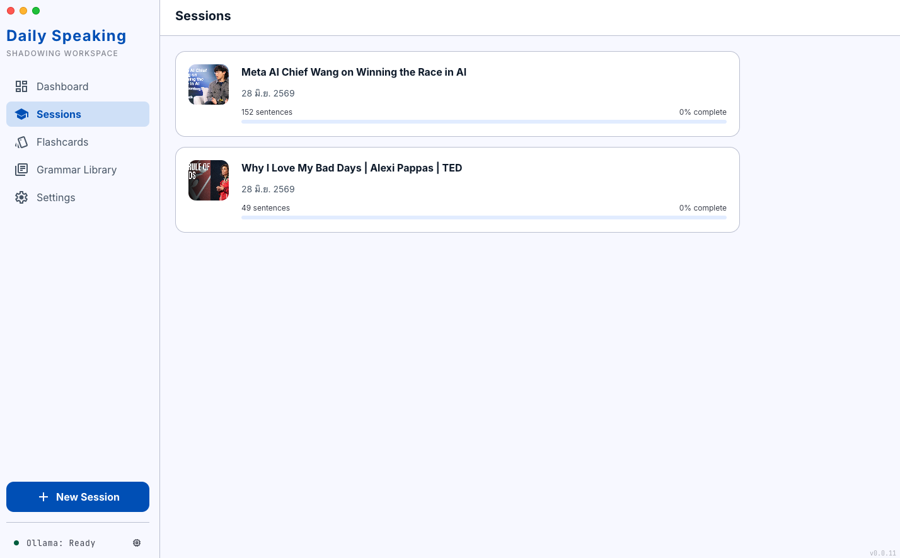
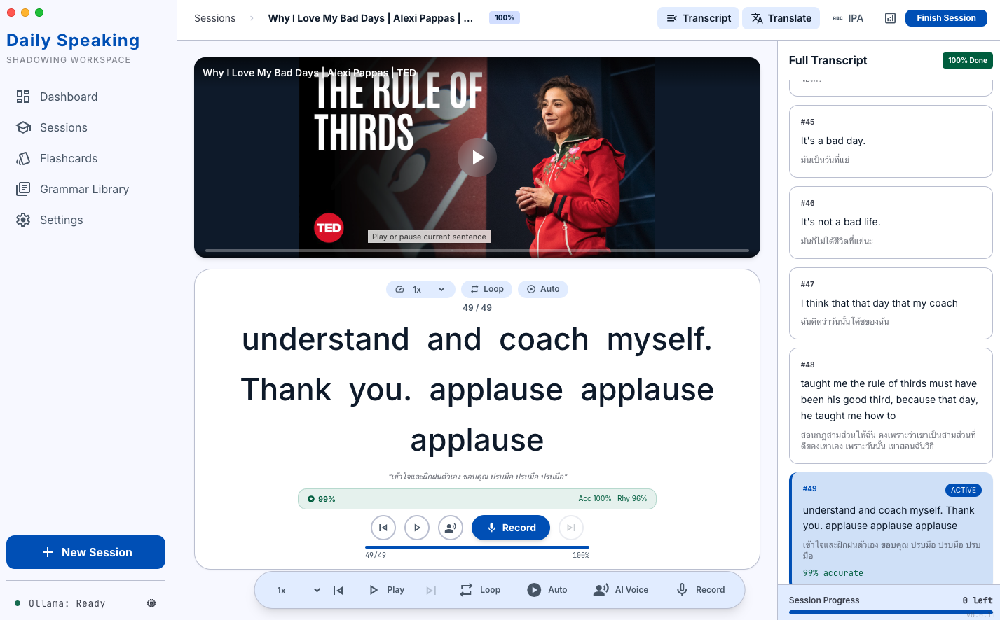

# Daily Speaking

Daily Speaking is a local-first macOS desktop app for English shadowing and speaking practice. Import a YouTube link, local media file, or transcript; the app transcribes and translates it into sentence-level practice, records your voice, scores attempts, creates flashcards, and generates a post-session comprehension exam.





## Features

- YouTube, video, audio, and pasted-transcript imports
- Local Whisper transcription and sentence segmentation
- Thai translation through configurable Ollama models
- Sentence playback, loop, auto-advance, speed control, AI voice, and recording
- Accuracy, pronunciation, rhythm, speed, and overall scores
- Persisted session progress shared by Practice, Sessions, and Dashboard
- Due-today SRS review plus a searchable **Show All** flashcard library
- **Flashcard management** — add your own cards, edit, delete one, or multi-select and delete many; the daily queue is capped by a **Maximum Due Cards** setting
- **Flashcard speaking review** — every card has an AI Voice button (cached locally after first play) and a **Speak** button that records you, transcribes with Whisper, and scores accuracy/pronunciation/rhythm/speed exactly like session practice
- AI-created sentence cards show **English on the front, Thai on the back**
- **Speaking Q&A** — pick a finished session and a question count; AI asks open-ended English questions (with Thai translation and voice), you answer out loud, and AI grades grammar and word order, corrects your sentence, and suggests a natural answer; retry to beat your score, and browse the full history of your past answers
- **Grammar practice chat** — press Practice on any grammar topic and an AI tutor explains it in Thai, gives you situations to respond to in English, and corrects each answer (type or answer by voice)
- Post-session AI analysis with vocabulary, grammar, and weak-sentence extraction
- AI-generated 5/7/10-question comprehension exams with tags, saved attempts, answer review, and unlimited retakes
- **Daily streak and 12-week activity heatmap** on the Dashboard, counting practice, flashcard reviews, speaking answers, and exams
- **Export All / Import All** — back up the entire app (database, media, recordings, voice cache) to one zip and restore it on another Mac; media paths are relinked automatically so you continue where you left off
- **Optional Gemini cloud provider** — per-feature switches in Settings let analysis/Speaking Q&A/grammar practice (`gemini-3.1-flash-lite`), translation (`gemini-3.1-flash-lite`), and AI voice (`gemini-3.1-flash-tts-preview`) run on Google Gemini instead of local models; everything defaults to local, and the app falls back to the local model if the key is missing or a call fails
- Local SQLite storage; no cloud account required (a Gemini API key is needed only if you opt into the Gemini provider)

The current release version is shown in the bottom-right corner of the app.

## Requirements

- macOS on Apple Silicon (the packaged DMG targets `arm64`)
- Node.js 18 or newer
- Homebrew
- FFmpeg, yt-dlp, and Python 3
- Ollama running at `http://localhost:11434`
- About 20 GB or more of free space, depending on installed models

## Setup

Clone the repository and enter it:

```bash
git clone <repository-url>
cd personal-project
```

Run the setup script. It installs the required system tools, Python packages, and default Ollama models:

```bash
chmod +x setup.sh build.sh
./setup.sh
```

If Ollama was installed separately, start it and pull the default models manually:

```bash
ollama serve
ollama pull qwen3.5:9b
ollama pull scb10x/typhoon-translate1.5-4b
ollama pull legraphista/Orpheus:latest
```

`qwen3.5:9b` is the default Post-Session Analysis model used for analysis and exam generation. You can replace it in **Settings → Post-Session Analysis Model**. Larger models such as `qwen3.6:27b` require substantially more memory and disk space.

Install JavaScript dependencies:

```bash
npm install
```

## Run in development

Make sure Ollama is running, then start Electron with hot reload:

```bash
npm run dev
```

The local database and imported media are stored under:

```text
~/Library/Application Support/Daily Speaking/
```

## Tests and checks

```bash
npm test
npx tsc --noEmit -p tsconfig.web.json
npm run build
```

## Build the macOS DMG

Run the full build script:

```bash
./build.sh
```

The script installs dependencies, rebuilds `better-sqlite3` for Electron, builds the main/preload/renderer bundles, and packages the app. The release artifact is created at:

```text
release/Daily Speaking-<version>-arm64.dmg
```

To install it, open the DMG and drag **Daily Speaking** into **Applications**. The current local build is unsigned, so on first launch use Finder's **Right-click → Open** flow if macOS asks for confirmation.

## How the app works

1. **Import** — media is downloaded or read locally, audio is extracted, Whisper transcribes it, and the translation model produces Thai sentence translations.
2. **Practice** — Electron plays only the active sentence range. Recording attempts are transcribed and scored, while progress is persisted to SQLite.
3. **Review** — weak sentences and saved words become flashcards (front English, back Thai). Due Today follows the SRS schedule and respects the Maximum Due Cards setting; Show All doubles as the card manager (add, edit, delete, multi-select delete). Each card can replay an AI voice from the local cache and score your spoken attempt.
4. **Analyze** — the configured Post-Session Analysis model summarizes weaknesses and extracts vocabulary/grammar.
5. **Exam** — after a session reaches 100%, the same analysis model creates a tagged comprehension quiz. Attempts, scores, selected answers, correct answers, and explanations are stored for history and retakes.
6. **Speak** — Speaking Q&A generates open-ended questions from a finished session. Your spoken answer is transcribed by Whisper and graded by the analysis model for grammar and word order, with a corrected sentence and a suggested natural answer. Every attempt is saved to the My Answers history and counted on the Dashboard.
7. **Grammar coaching** — the Grammar Library's Practice button opens a chat where the AI tutor teaches the topic in Thai and drills you with English challenges, correcting each response.
8. **Backup & move machines** — Settings → Data Backup exports the database plus all media into a single zip; importing that zip on another Mac restores everything and relinks file paths automatically.
9. **Choose your AI provider** — Settings → Gemini Provider stores a Google API key and offers three independent switches (Analysis/Speaking/Grammar, Translation, AI Voice). Local Ollama/Whisper remains the default; Gemini is used only when a switch is set *and* a key is present, with automatic local fallback on errors, so offline use keeps working.

## Architecture

```text
Electron main process
├── SQLite and filesystem (plus zip export/import of all data)
├── FFmpeg / yt-dlp / Whisper
├── Provider-routed AI: Ollama (default, local) or Google Gemini (optional)
│   for translation, analysis, TTS, exams, and speaking questions
└── IPC handlers
    └── React renderer (Dashboard, Sessions, Practice, Flashcards, Speaking Q&A, Grammar, Exams)
```

Heavy transcription and model work runs outside the React renderer so the interface stays responsive. Model names and the Ollama URL can be changed from Settings without changing application code.
